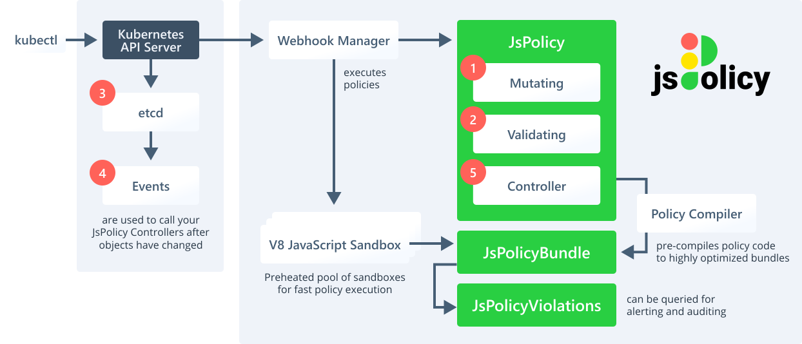

<br>
<a href="https://www.jspolicy.com"></a>

### **[Website](https://www.jspolicy.com)** • **[Getting Started Guide](https://www.jspolicy.com/docs/getting-started/installation)** • **[Documentation](https://www.jspolicy.com/docs/why-jspolicy)** • **[Blog](https://loft.sh/blog)** • **[Twitter](https://twitter.com/loft_sh)** • **[Slack](https://slack.loft.sh/)**


### jsPolicy - Easier & Faster Kubernetes Policies using JavaScript or TypeScript
- **Lightning Fast & Secure Policy Execution** - jsPolicy runs policies with Google's super fast V8 JavaScript engine in a pool of pre-heated sandbox environments. Most policies do not even take a single millisecond to execute
- **Great Language For Policies** - JavaScript is made for handling and manipulating JSON objects (short for: JavaScript Object Notation!) and Kubernetes uses JSON by converting your YAML to JSON during every API request
- **3 Policy Types** for anything you need:
  - **Validating Policies** - Request validation that is as easy as calling `allow()`, `deny("This is not allowed")`, or `warn("We'll let this one slip, but upgrade to the new ingress controller")`
  - **Mutating Policies** - Simple mutations of the kubectl request payload via `mutate(modifiedObj)`
  - **Controller Policies** - Run custom JavaScript controllers that react to any changes to the objects in your cluster (controller policies are reactive, so they are not webhooks and part of a Kubernetes API server request but instead react to `Events` in your cluster after they have happened). With controller policies you can write resource sync mechanisms, enforce objects in namespaces, garbage collectors or fully functional CRD controllers
- **Simple yet Powerful** - Create a functional webhook with a single line of JavaScript or write your own fully blown custom StatefulSet controller in TypeScript with jsPolicy. There are no limits and the possibilities are endless
- **Easy Cluster Access** - Control cluster state with built-in functions such as `get("Pod", "v1", "my-namespace/my-pod")`, `list("Namespace", "v1")`, `create(limitRange)`, `update(mySecret)` or `remove(configMap)`
- **Focus on Policy Logic** - Jump right in and only focus on writing your own policy logic or simply reuse existing policies. Let jsPolicy do the rest and don't worry about high-availability, performance tuning, auditing, certificate management, webhook registration, prometheus metrics, shared resource caches, controller boilerplate, dynamic policy management etc. anymore
- **Turing Complete Policy Language** - Use `loops`, `Promises`, `generator` functions, `?` operators, TypeScript Type-Safe practices, hot reloaders, linting, test frameworks and all other modern JS language features and development best practices for writing clean and easy to maintain policy code
- **Huge Ecosystem of Libraries** - Use any CommonJS JavaScript or TypeScript library from npmjs or from your private registry
- **Easy Policy Sharing & Reuse** - Share entire policies or reusable functions via npmjs or via your private registry
- **Efficient Policy Development** - Use any of the dev tools available in JavaScript or TypeScript for a highly efficient workflow


Learn more on [www.jspolicy.com](https://www.jspolicy.com).


[](https://slack.loft.sh/)

<br>

## Architecture 
[](https://www.jspolicy.com)


Learn more in the [documentation](https://www.jspolicy.com/docs/why-jspolicy).

<br>

<p align="center">
⭐️ <strong>Do you like jsPolicy? Support the project with a star</strong> ⭐️
</p>

<br>

## Quick Start
To learn more about jspolicy, [**open the full getting started guide**](https://www.jspolicy.com/docs/getting-started/installation).

### 1. Install jsPolicy
Install jsPolicy to your Kubernetes cluster via Helm v3:
```bash
helm install jspolicy jspolicy -n jspolicy --create-namespace --repo https://charts.loft.sh
```


### 2. Create a Policy
Create the file `policy.yaml`:
```bash
# policy.yaml
apiVersion: policy.jspolicy.com/v1beta1
kind: JsPolicy
metadata:
  name: "deny-default-namespace.company.tld"
spec:
  operations: ["CREATE"]
  resources: ["*"]
  scope: Namespaced
  javascript: |
    if (request.namespace === "default") {
      deny("Creation of resources within the default namespace is not allowed!");
    }
```

### 3. Apply The Policy
Apply the policy in your cluster:
```bash
kubectl apply -f policy.yaml
```


### 4. See Policy In Action
```bash
kubectl create deployment nginx-deployment -n default --image=nginx
```

## Contributing

Thank you for your interest in contributing! Please refer to
[CONTRIBUTING.md](https://github.com/loft-sh/jspolicy/blob/main/CONTRIBUTING.md) for guidance.

<br>

---

This project is open-source and licensed under Apache 2.0, so you can use it in any private or commercial projects.
